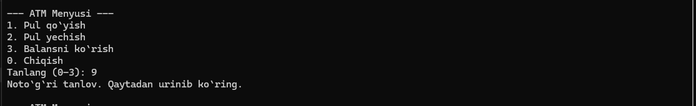

# Weekly Assignment ATM

> How does the program work ?

## Getting information from the user

> The ATM menu will come out and the user will select the section he needs

## Add money

## View balance

## Get money

> You can also see the balance here

## If there are not enough funds in the balance

## Incorrect selection in the main menu and exiting the menu

